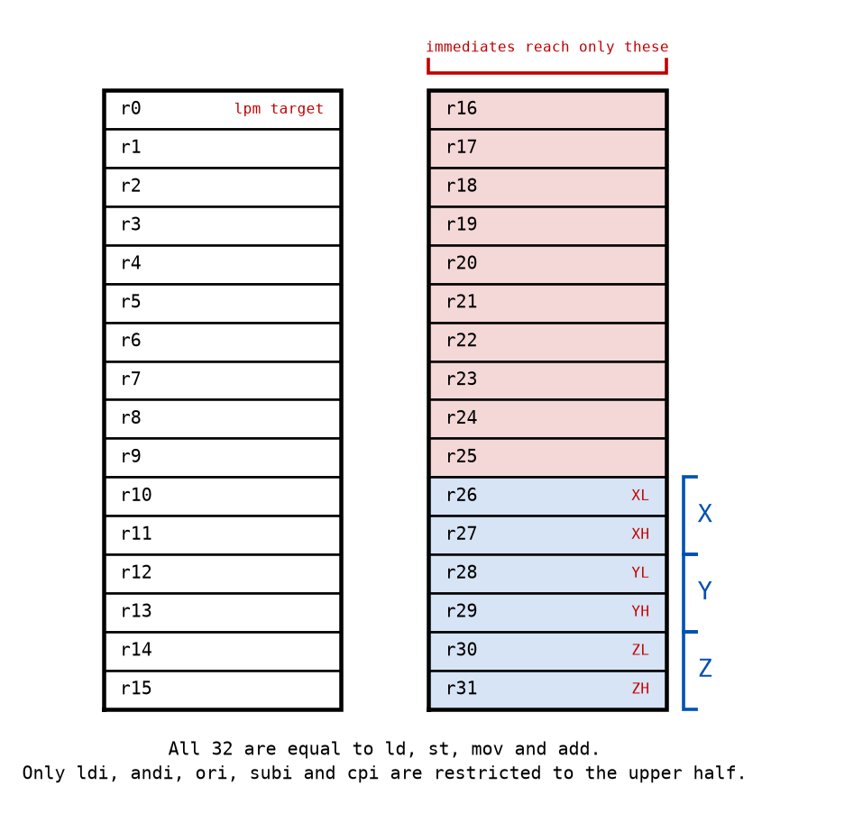
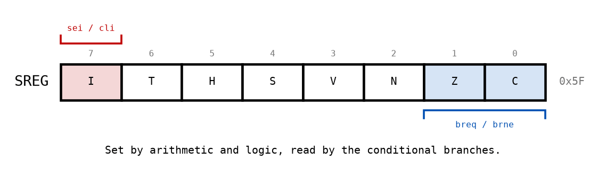
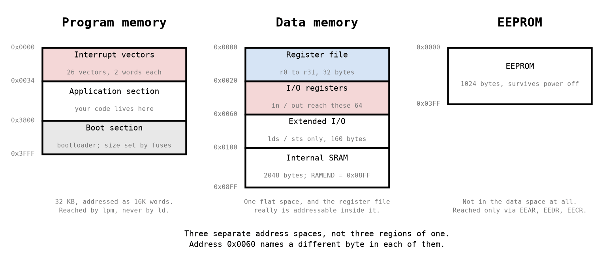
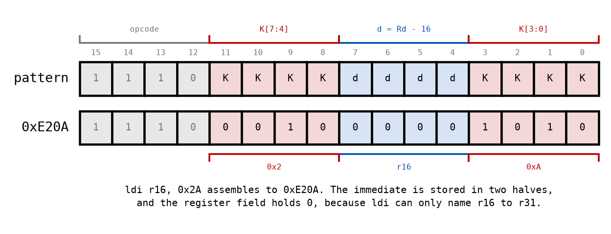

# Appendix A - The AVR Core

## A.1 What kind of machine this is
An ATmega328P is an 8-bit microcontroller with 32 registers, 2 KB of RAM, 32 KB of flash, and no
operating system, no memory protection, and no cache. It runs one instruction at a time, and
almost every instruction takes one clock cycle.

Three of its properties will contradict something you know from C, and it is worth naming them
before they surprise you rather than after.

**It is a load-store machine.** Arithmetic happens between registers and nowhere else. There is
no instruction that adds two bytes of memory together; you load one into a register, load the
other into another register, add, and store the result back. In C you write `a += b` and the
compiler decides how many instructions that is. Here you are the compiler.

**It is a Harvard machine.** Program memory and data memory are separate address spaces with
separate instructions. A pointer to a constant string in flash and a pointer to a variable in RAM
are both 16-bit numbers, and they are not interchangeable, and nothing checks. This is the single
biggest departure from the flat address space C leads you to expect (A.4).

**It has 32 registers, and they are not all equal.** They are equal to most instructions and
unequal to a handful of important ones, and the handful is what shapes real AVR code (A.2).

What it is *not* is slow or crude. At 16 MHz it executes 16 million instructions a second, and
almost every one of them does something useful. The reason to write assembly here is not that the
compiler is bad; it is that on a machine this small you can hold the whole of it in your head, and
knowing exactly what a routine costs is worth something.

---

## A.2 The register file
Thirty-two 8-bit registers, named `r0` to `r31`. Every one of them can be a source or a
destination for `mov`, `add`, `and`, `or`, `ld`, `st` and most of the rest of the instruction set.



Two things about that picture matter more than the other thirty.

**Only `r16` to `r31` can be loaded with a constant.** `ldi r16, 0x2A` is legal;
`ldi r15, 0x2A` is not, and the assembler will tell you so. The same restriction applies to
`andi`, `ori`, `subi`, `cpi` and `sbci`. The reason is not arbitrary: those instructions spend
eight of their sixteen bits on the constant, which leaves four bits for the register number, and
four bits can only count to sixteen (A.6).

The practical consequence is that the upper half is where the work happens and the lower half is
where you park things. A routine that needs five working registers and reaches for `r10` will
find it cannot put a constant in it, and will end up loading the constant into `r16` and moving
it, which costs an extra instruction every time.

**`r26` to `r31` are also the three pointer registers.** Taken in pairs they form the 16-bit
pointers `X` (`r27:r26`), `Y` (`r29:r28`) and `Z` (`r31:r30`). They are still ordinary registers;
nothing stops you using `r30` to hold a loop counter. But the moment you want to read memory
through a pointer, they are the only six that can do it, and a routine that has casually filled
them with something else has to spill them first. L04 is about this in earnest.

`r0` and `r1` deserve a note. `r0` is where `lpm` deposits the byte it read from program memory,
so a routine using `lpm` cannot also be keeping something in `r0`. `r1` has no hardware role at
all, but the C compiler keeps zero in it permanently, which matters the moment you call C from
assembly or the reverse. That is L06's problem; for now, leaving both alone costs you nothing.

---

## A.3 The status register
`SREG` is one 8-bit register holding the flags that arithmetic writes and branches read.



| Bit | Name | Set when |
|---|---|---|
| 7 | `I` | Interrupts are globally enabled. Set by `sei`, cleared by `cli`. |
| 6 | `T` | A bit copied by `bst`, to be copied back by `bld`. Rarely used. |
| 5 | `H` | A carry out of bit 3, for BCD arithmetic. Rarely used. |
| 4 | `S` | `N` exclusive-or `V`: the sign of a *signed* comparison. |
| 3 | `V` | A signed overflow occurred. |
| 2 | `N` | The result's most significant bit was set. |
| 1 | `Z` | The result was zero. |
| 0 | `C` | A carry out of bit 7, or a borrow. |

In practice you will use two of them constantly and the rest almost never. `Z` and `C` are what
`cp`, `cpi` and every arithmetic instruction leave behind, and what the branches test:

| Branch | Taken when | Reads |
|---|---|---|
| `breq` | the two values were equal | `Z` set |
| `brne` | they were not equal | `Z` clear |
| `brlo` | the first was lower, unsigned | `C` set |
| `brsh` | the first was the same or higher, unsigned | `C` clear |

**`cp` and `cpi` are subtractions whose result is thrown away.** That is the whole of what a
comparison is on this machine: `cp r19, r24` computes `r19 - r24`, discards the difference, and
keeps the flags. So `cp` followed by `breq` means "branch if equal", and `cp` followed by `brlo`
means "branch if the first was lower". If you find yourself unsure which way round a comparison
reads, write out the subtraction and the ambiguity disappears.

**The flags are the most volatile state on the machine.** Nearly every instruction writes some of
them, so `cp` and its branch must be adjacent, or nearly so. A `mov` between them is harmless
because `mov` writes no flags; an `inc` between them is a bug, and one that shows up as a branch
going the wrong way for no visible reason. When you cannot remember whether an instruction touches
the flags, the instruction set summary has a column for it, and that column is the reason it
exists.

Bit 7, `I`, is different in kind from the other seven. It is not a result of anything; it is a
switch, and it controls whether interrupts can happen at all. L03 is where it matters.

---

## A.4 Three address spaces
This is the part that most often goes wrong for a reader arriving from C, so it is worth being
slow about.



There is no single address space on this machine. There are three, they overlap numerically, and
nothing in the instruction set or the assembler will stop you reading one when you meant another.

**Program memory** holds your instructions and any constants you put there deliberately. It is
addressed in **words**, not bytes, which is why `PCINT0`'s slot is quoted as `0x06` while GNU `as`
wants `0x0C`. The entries being 2 apart is a separate fact: each slot is two words, so that a
two-word `jmp` fits in one
([L03 A.2](../../L03/appendix/a_interrupts.md#a2-the-vector-table)).

Only `lpm` reads it. An ordinary `ld` pointed at "address 0x0100" reads SRAM, not the code at word
`0x0100`, and does so silently.

**Data memory** is one flat space containing four things in order: the register file, the 64 I/O
registers, 160 extended I/O registers, and finally 2048 bytes of actual SRAM starting at `0x0100`.
`RAMEND` is `0x08FF`, and it is where you point the stack (D.6).

The register file really is addressable there. `lds r16, 0x0005` loads the contents of `r5`. This
is true, occasionally useful for a debugger, and something no ordinary program does, because
`mov r16, r5` does the same thing in one cycle instead of two.

**EEPROM** is 1024 bytes of memory that survives power being removed. It has its own address
space and **no load or store instruction reaches it at all**; you write an address into `EEAR`, a
byte into `EEDR`, and set a bit in `EECR`. This course does not use it, but knowing it is a third
space rather than a region of the second is the point.

---

## A.5 The I/O window: two names for one register
Every I/O register has two addresses, and both appear in the datasheet.

`PORTB` is **I/O address `0x05`** and **data space address `0x25`**. They differ by `0x20`,
because the I/O registers begin `0x20` bytes into the data space. Which number you use depends
entirely on which instruction you are writing:

| Instruction | Takes | Reaches | Cost |
|---|---|---|---|
| `in` / `out` | an I/O address, 0 to 63 | the low 64 I/O registers | 1 cycle |
| `sbi` / `cbi` | an I/O address, 0 to 31 | the low 32, one bit at a time | 2 cycles |
| `lds` / `sts` | a data space address | anywhere in data memory | 2 cycles |
| `ld` / `st` | a pointer register | anywhere in data memory | 2 cycles |

Giving one of them the other's number is the classic first AVR bug. `out 0x25, r16` writes to I/O
register `0x25`, which is data space `0x45`, which is `TCCR0B`: Timer0's clock select and its
waveform mode. Your LED does nothing, your program looks correct, and somewhere else a timer you
have not written yet is running at a rate you did not choose.

In this course you will rarely write either number, because `.include "m328Pdef.inc"` defines
`PORTB` for you, and it defines it as the **I/O** address, `0x05`. So `out PORTB, r16` is right,
and reaching the same register with `sts` means writing the `0x20` yourself:

```asm
out PORTB, r16              ; the I/O address, 0x05
sts PORTB + 0x20, r16       ; the same register through the data space, 0x25
```

**Not every register works that way, and the device file tells you which.** `WDTCSR` is `0x60`
and `TCCR1B` is `0x81`, data space addresses already, because those registers live above the
I/O window and `out` cannot reach them at all. `m328Pdef.inc` marks them `; MEMORY MAPPED`, and
that comment is the whole rule: if it is there, the number is a data space address and you add
nothing; if it is not, the number is an I/O address and `sts` needs `+ 0x20`.

**The mistake this invites is worse than a wrong register.** Write `sts PORTB, r16` and it
assembles without complaint to data space `0x0005`, which is not a peripheral at all, but the
general-purpose register **r5**. Your port never changes, a register you were using quietly
takes the value instead, and nothing anywhere reports a problem. Assembly written for `avr-gcc`
does exactly this, because there `PORTB` already means `0x25`; carrying such a line across
unchanged is the single most productive source of this bug.
[Appendix B.7](./b_toolchain.md#b7-opening-this-course-in-microchip-studio) has the rest of that
comparison.

---

## A.6 What an instruction is
Every AVR instruction is one or two 16-bit words. `ldi` is one word, and every bit of it is
accounted for.



```math
\text{ldi } R_d, K \;\longrightarrow\; \texttt{1110}\;K_{7:4}\;d_{3:0}\;K_{3:0}
\qquad\text{where } d = R_d - 16
```

Three things fall out of that layout, and all three are facts about the machine rather than about
notation.

**The immediate is split in half.** Bits 11 to 8 carry the top nibble and bits 3 to 0 the bottom
one, with the register number in between. There is no reason for this beyond the encoding being
easier to decode in hardware that way, and it is the detail that makes hand-assembling an `ldi`
feel like a puzzle the first time.

**The register field is four bits, so it counts 0 to 15**, and the machine adds 16. That is the
whole explanation for A.2's restriction: `ldi` cannot name `r15` because there is nowhere in the
instruction to put the number 15 and mean the sixteenth register.

**The opcode is only four bits.** `1110` means `ldi` and nothing else, which is a lot of encoding
space for one instruction, and is why the immediate can afford to be a full byte.

So `ldi r16, 0x2A` is `1110 0010 0000 1010` = `0xE20A`. You will confirm that number three ways in
this lecture: by hand, by calling your own `encodeLdi` (C.5), and by looking at what `avr-objdump`
says the assembler produced (B.3).

---

## A.7 What this machine does not have
Naming the absences early saves you looking for them later.

**No barrel shifter.** `lsl r18` shifts by exactly one bit. There is no instruction that shifts by
a variable number of places, so `1 << n` for a runtime `n` is a *loop*, and it costs about six
cycles per bit. That is the whole reason `shift_bits` (D.3) exists, and it is worth sitting with:
an operation that is free in C is a loop here, and a driver that calls it with a pin number costs
different amounts for different pins.

**No division.** There is a hardware multiply (`mul`, two cycles), but division is a library
routine, and a slow one. Powers of two are shifts; everything else is expensive.

**No stack frame, and no stack pointer discipline.** There is a stack pointer, `SP`, and `rcall`
and `ret` use it, and that is the entire mechanism. Local variables, parameter passing beyond a
few registers, and reentrancy are conventions you follow or fail to follow. Nothing enforces them.
L02 is about the convention; L04 is about the stack itself.

**No protection of any kind.** Writing past the end of an array walks into whatever is next.
Pointing `Z` at `0x0000` and storing writes to `r0`. Recursing too deep grows the stack down into
your variables and there is no fault, no message, and no crash, just wrong answers.

**And no `nop`-free timing.** There is no cache, no branch predictor and no pipeline stall you
have to reason about, which is the good news hiding inside all of the above: an instruction's
cost is a number in a table, the same number every time. That is what makes
[Appendix C](./c_counting_cycles.md) possible, and it is a property most machines lost decades
ago.

---
