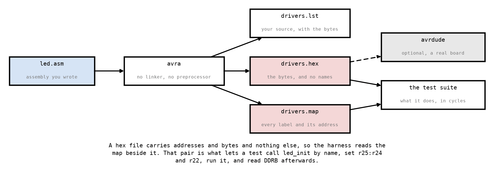

# Appendix B - The Toolchain

## B.1 What assembling actually does
An assembler is the least clever program in your toolchain. It reads one line at a time, turns
each instruction into the one or two words that encode it
([A.6](./a_avr_core.md#a6-what-an-instruction-is)), resolves the labels, and writes the result
out. It does not reorder anything, it does not allocate
registers, and it does not check that what you wrote makes sense. If you write `ldi r16, 0x2A`, you
get `0xE20A`, and if you write a loop with no exit you get a loop with no exit.

That is the whole appeal. Everything the machine does is something you wrote.



---

## B.2 `avra` as an assembler
This course assembles with `avra`, which takes AVRASM2, the syntax Microchip Studio assembles,
and never uses the C compiler except in L06:

```bash
avra -I /usr/share/avra -I drivers/include -D F_CPU=16000000 \
     -l drivers/build/drivers.lst -m drivers/build/drivers.map \
     -o drivers/build/drivers.hex drivers/build/drivers_unit.asm
```

Each of those is load-bearing:

| Flag | Why |
|---|---|
| `-I /usr/share/avra` | Where `m328Pdef.inc` lives, which is what gives you `PORTB` and `RAMEND`. |
| `-I drivers/include` | Where the course's own `.inc` contracts live. |
| `-D F_CPU=16000000` | The clock, as a symbol your own source may use. Nothing in the course requires it; L05's arithmetic is easier to write against a name than a literal. |
| `-l ....lst` | The listing: your source with the encoding beside every line. B.3. |
| `-m ....map` | The map: every label and its address. **The tests read this.** |
| `-o ....hex` | Intel hex, which is what the simulator loads. |

You will rarely type that, because `make build` does it. Two of the values are overridable from
the environment for the same reason: `F_CPU=8000000 make build` assembles against a different
clock, and `AVRA_INCLUDE=... make build` is what a non-apt install of `avra` needs, because its
device files will not be in `/usr/share/avra`.

**The device is chosen by the file you include, not by a flag.** There is no `-mmcu` here;
`.include "m328Pdef.inc"` is the whole of that decision, and it is why the line belongs at the
top of every source file you write.

**`avra` has no linker.** It assembles exactly one file, so `ci/build.sh` writes a top-level unit
that `.include`s every source in `drivers/source` and assembles that instead. You never edit it.
When you want to know what was assembled and in what order, read
`drivers/build/drivers_unit.asm`; it is one line per source plus two, and generated fresh on every
build.

Two conventions the files in this course follow:
* **`;` starts a comment**, to the end of the line.
* **Every label is global already.** `avra` exports all of them, so there is no `.global` to
  write and no way to forget it. A test that cannot find your subroutine is telling you about a
  spelling or a file that did not assemble, never about a missing directive.

---

## B.3 Reading a disassembly
The listing file is the assembler telling you what it produced, line by line, against the source
you gave it. `make build` writes one every time:

```bash
less drivers/build/drivers.lst
```

```text
C:000000 01fc          movw r30, r24            ; Z = the struct
C:000001 e203          ldi  r16, low(PINB + 0x20)
C:000002 8300          std  Z + LED_PIN_REG, r16
```

The first column is the **word** address, the second is the encoding, and the rest is your own
line, comment included. That is the source you wrote, the bits it became, and the address each
landed at, all on one line.

To disassemble instead, starting from the machine code and recovering the instructions, which is
the skill this course is actually after, point `avr-objdump` at the hex:

```bash
avr-objdump -D -m avr:5 -b ihex drivers/build/drivers.hex
```

`-b ihex` is needed because a hex file says nothing about what architecture it is for, and
`-m avr:5` supplies the answer. **The symbol names are gone**, and the output says `.sec1` where
an ELF would have said `<led_init>`; a hex file carries addresses and bytes and nothing else,
which is exactly why the tests read the map file alongside it.

```text
Disassembly of section .sec1:

00000000 <.sec1>:
   0:   21 e0           ldi     r18, 0x01       ; 1
   2:   30 e0           ldi     r19, 0x00       ; 0
   4:   38 17           cp      r19, r24
   6:   19 f0           breq    .+6             ; 0xe
   8:   22 0f           add     r18, r18
   a:   33 95           inc     r19
   c:   fb cf           rjmp    .-10            ; 0x4
   e:   82 2f           mov     r24, r18
  10:   08 95           ret
```

Four columns: the byte address, the encoded words, the instruction, and a comment. Four things in
that listing are worth noticing on your first read.

**There is one block and it is called `.sec1`.** Not `shift_bits`, not `shift_bits_loop`: a hex
file has no symbol table, so `objdump` invents one section name for the whole run of bytes and
labels every branch target with a bare address. The names are in `drivers.map`, which is the other
file `avra` wrote and the one the tests read. Compare this against the listing above, where your
own label sits on the line that produced it. The listing knows the names because it is the
assembler talking, and the disassembly does not because it is only ever given bytes.

**The bytes are little-endian.** `ldi r18, 0x01` shows as `21 e0`, and the word is `0xE021`. Hold
that against [A.6](./a_avr_core.md#a6-what-an-instruction-is): opcode `1110`, `K[7:4]` = `0000`,
`d` = `0010` (so `r18`), `K[3:0]` = `0001`. It checks out, and reading it in the wrong byte order
is a small rite of passage.

**Addresses here are bytes, not words.** The `rjmp` at the bottom goes back to `0x04`, which is
word `0x02` and so the *third* instruction: words `0x00` and `0x01` hold the two `ldi`s above it.
The vector table is quoted in words and the disassembly in bytes, and keeping
the two apart is a recurring nuisance that this appendix cannot make go away.

**`lsl r18` came back as `add r18, r18`.** They are the same instruction: shifting left by one and
adding a number to itself do the same thing to the bits and set the same flags, so the assembler
encodes `lsl` as `add` and the disassembler has no way to know which you wrote. Several AVR
mnemonics are aliases like this, and a disassembly that does not match your source line for line
is usually one of them rather than a mistake.

---

## B.4 Two images, for two jobs
`make build` produces two, and confusing them wastes an afternoon.

**`drivers/build/drivers.hex`** is the subroutines alone. It has no reset vector and no vector
table; nothing ever runs it from the start. The unit tests set the program counter straight to a
symbol and call one subroutine at a time. This is the image nearly everything in this course
loads, and it is the one `make measure` uses by default.

**`drivers/build/app.hex`** is `drivers/app/main.asm` assembled together with those same
subroutines: a whole program with a vector table and a main loop. L01's program test and L03's
integration test load this one and let it run, because a program cannot be called and an
interrupt has to arrive. Reach it with `make measure IMAGE=app`.

Each comes with a `.map` beside it, and the two are read together: the hex is the program and
the map is the names. Delete one and the harness reports the other missing.

---

## B.5 Running the tests
From the repository root:

```bash
make test
```

Every lecture's suite is cumulative, so this runs L01's now and will still be running it in L05.
What is in a suite decides for itself whether to run: the tests that check the pinned device
constants always run, and the ones that call your assembly are switched on by their `.asm` file
existing. Nothing has to be registered anywhere. See
[the suite's README](../exercises/test/README.md).

Two failures worth recognising before you meet them:

* **`Utils.SubroutinesAreDefined` fails and the file is plainly there.** The label is spelled
  differently from the name the test asks for, or the file did not assemble and the build said so
  further up. `avra` needs no `.global`, so it is never that.
* **A cycle count comes back as 100001.** That is the simulator's budget running out, which is
  what an infinite loop looks like from outside.

---

## B.6 Measuring a subroutine
A test tells you pass or fail. A cross-check needs the number itself, so this course ships a tool:

```bash
make measure SYMBOL=shift_bits ARG=5
```

```text
shift_bits(r25:r24 = 0x0005, r22 = 0)
  cycles     40
  time       2.500 us at 16.0 MHz
  returned   r24 = 32 (0x20)

deepest stack: SP reached 0x08FD, 2 bytes below RAMEND
```

It assembles whatever is in `drivers/source`, loads it, sets `r25:r24` and `r22` to the arguments
you gave, calls the symbol, and reports what came back and what it cost. `IMAGE=app` measures
against the whole program instead of the library, which is what an interrupt handler needs (B.4).

**The figure excludes the `rcall` that would have got you there**, because there was no `rcall`:
the tool sets the program counter directly, the way the tests do. That is not a defect and it is
not hidden from you; it is the first term of the discrepancy
[Appendix E](./e_exercises.md)'s cross-check asks you to account for.

---

## B.7 Opening this course in Microchip Studio
Everything in `drivers/source` is AVRASM2, which is what Microchip Studio's assembler takes. A
file from this course opens there and single-steps without being translated first, and that is
the reason for the choice: the Processor Status window showing `R16` change, and the I/O view
letting you tick a bit of `PINB` to fake a button press, apply to **your** code rather than to a
port of it.

Nothing in this course requires Studio, and no exercise depends on it. It is Windows-only, and
`make test` measures everything Studio would show you and rather more besides. But if you have it,
this is how it fits:

1. **File → New → Project → AVR Assembler Project**, targeting the ATmega328P.
2. Replace the generated `.asm` with one of yours, or add yours to the project.
3. **Debug → Start Debugging and Break**, and pick **Simulator** as the tool when asked.
4. **Debug → Windows → Processor Status** for the register file, and **I/O** for the peripherals.

Two differences from the build here, neither of which is a syntax question:

* **Studio assembles one file and this repo assembles all of them.** `ci/build.sh` generates a
  unit that includes every source (B.2); a Studio project has whatever you put in it. A
  subroutine that assembles here and is missing there is usually a file you did not add.
* **`m328Pdef.inc` comes from a different place.** Studio ships its own copy and finds it
  automatically; `avra` uses the one in `/usr/share/avra`. They agree about the ATmega328P, which
  is the only device this course targets.

### The vector table, in the units the datasheet uses
`.org` counts **words** in AVRASM2, and so does the datasheet's vector table. `.org 0x0006` is
PCINT0 in both, and no conversion stands between them. Better still, `m328Pdef.inc` names them:

```asm
.org PCI0addr
    rjmp isr_pcint0
```

`PCI0addr`, `WDTaddr`, `OC1Aaddr` and the rest are defined in the device file, so the magic number
need not appear in your program at all. L03 is where this matters.

> **Reading GNU `as` code elsewhere?** Most AVR assembly published online is written for
> `avr-gcc`, where `.equ` takes a comma, register names come from `<avr/io.h>`, `PORTB` means the
> data space address `0x25` rather than the I/O address `0x05`, and **`.org` counts bytes**, so
> the same vector table is written `.org 0x000C`. L06's appendix C shows that dialect properly,
> because that is the one lecture where this course links against a C compiler.

---
