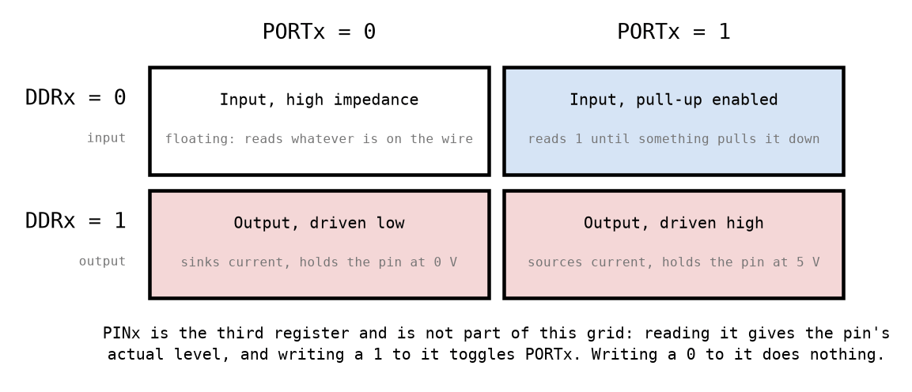
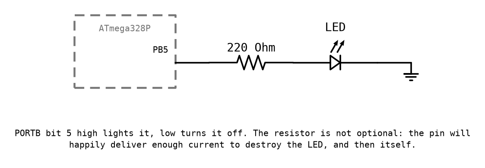
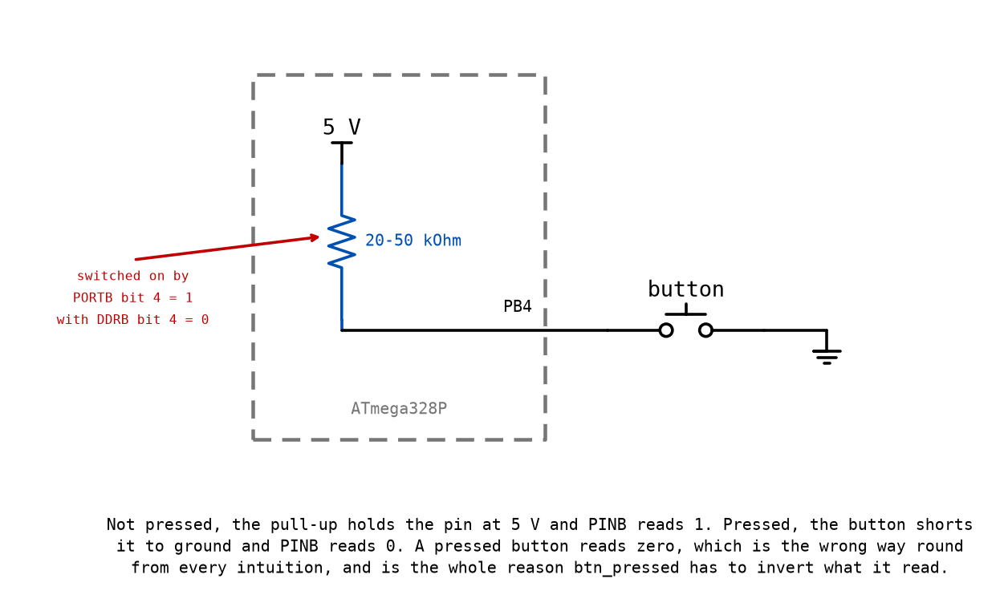
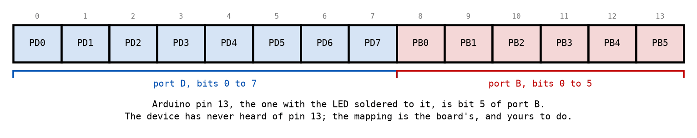

# Appendix A - I/O Ports

## A.1 Three registers per port
You have already used two of these. `sbi DDRB, 5` and `sbi PORTB, 5` lit an LED at the end of L01
([L01 D.6](../../L01/appendix/d_first_subroutine.md#d6-the-program)), on one sentence's worth of
explanation: `DDRx` decides whether a pin is an output and `PORTx` decides what an output drives.
That sentence is true and it is about a third of the story, and the missing two thirds are what
makes a driver possible.

The ATmega328P has three I/O ports available on an Arduino Uno, called B, C and D, and each is
controlled by three registers. For port B those are `DDRB`, `PORTB` and `PINB`, at data space
addresses `0x24`, `0x25` and `0x23`
([L01 A.5](../../L01/appendix/a_avr_core.md#a5-the-io-window-two-names-for-one-register)).

The names are unhelpful in a specific way, so it is worth stating what each one is before
anything else:

| Register | What it is | Read or write |
|---|---|---|
| `DDRx` | **D**ata **D**irection **R**egister. One bit per pin: 0 is input, 1 is output. | Both |
| `PORTx` | For an output pin, the level to drive. For an input pin, the pull-up switch. | Both |
| `PINx` | The level the pin is actually at. Writing a 1 to it toggles `PORTx`. | Both, differently |

`PORTx` is the one that trips people up, because it does two entirely unrelated jobs depending on
what `DDRx` says. And `PINx` is the one that surprises them later, because writing to it does
something that has nothing to do with reading it.

---

## A.2 Four states of a pin
Two control bits, four combinations, and each one is a different piece of hardware behaviour.

**A floating input is the dangerous one.** With `DDRx = 0` and `PORTx = 0` the pin is connected to
nothing at all, and reading `PINx` gives you whatever the surrounding electrical noise induced on
it. It is not random in a useful sense and it is not stable; it will read 1 while your finger is
near the board and 0 when it is not. An input you have not either pulled up or wired to something
is a bug, not a default.

**The pull-up is the reason the other three states are easy.** Setting `PORTx = 1` on an input pin
connects an internal resistor of 20 to 50 kΩ between the pin and 5 V. Now the pin reads 1 unless
something actively pulls it down, which is exactly what a button to ground does.

**An output ignores the pull-up entirely.** Once `DDRx = 1`, `PORTx` means "the level to drive",
and the resistor is out of the picture.

---

## A.3 Writing to PINx toggles the output
This is the one genuinely strange thing in this appendix, and it is worth being explicit about
because the name gives no hint of it.

Writing a **1** to a bit of `PINx` **toggles the corresponding bit of `PORTx`**. Writing a 0 does
nothing at all. Reading `PINx` is unaffected and still gives the pin's actual level.

So storing a mask into `PINB` flips exactly the bits the mask selects, and leaves the rest alone
without having to read anything first. A toggle is one store, and the alternative is a load, an
exclusive-or and a store. It is faster
and, more importantly, it cannot be interrupted halfway through, which is a property L03 will
make matter.

Two things this does **not** mean:

* It does not toggle the pin directly. It toggles `PORTx`, so on an input pin it toggles the
  pull-up, which is occasionally useful and usually a mistake.
* It is not "writing to the input register", whatever the name suggests. Nothing you write to
  `PINx` is ever read back from `PINx`.

---

## A.4 An LED, and a resistor that is not optional

Configure the pin as an output, drive it high, and current flows through the LED. Drive it low and
it stops. That is the whole circuit, and the driver in
[Appendix C](./c_led_driver.md) is a way of saying it in assembly.

The resistor sets the current. An LED is not a resistor: its voltage barely changes with current,
so without something to limit it the current is set by how much the pin can supply, which is about
40 mA, which is roughly twice what a small LED survives and exactly the pin's absolute maximum.
The usual outcome is a dead LED; the occasional outcome is a dead pin.

An Arduino Uno already has an LED and a resistor on pin 13, which is why every example in this
course uses pin 13 and why none of them requires you to wire anything.

**The other way round works too, and you will meet it.** An LED can be wired from 5 V through its
resistor to the pin, in which case driving the pin *low* lights it. That is called sinking rather
than sourcing, and it inverts everything your driver means. It is not wrong; it is a different
board, and reading `led_on` without knowing which one you have is how you end up with a program
that is exactly backwards. On this part the two directions are specified the same, whatever the
folklore about older AVRs says: 20 mA either way.

---

## A.5 A button, and why pressed reads zero

Configure the pin as an input and switch the pull-up on. With the button not pressed, nothing else
is connected to the pin, and the pull-up holds it at 5 V, so `PINx` reads **1**. Press the button
and the pin is shorted to ground, so `PINx` reads **0**.

**A pressed button reads zero.** Every driver in this course that reports "is it pressed" therefore
has to invert what it read, and forgetting to is a bug that produces a program which does exactly
the opposite of what it should, reliably, which is at least easy to spot.

The alternative wiring, a button from the pin to 5 V with an external pull-down resistor, gives the
intuitive polarity. Nobody does it, because it needs a resistor you have to fit and the pull-up is
free.

**What the pull-up does not do is debounce.** A mechanical button does not close once; it closes,
bounces open, closes again, several times over a few milliseconds. The pin faithfully reports every
one of those, so a program that counts presses by watching for a 1-to-0 transition will count one
press as four. That is not this lecture's problem, but it is the reason L03's interrupt-driven
button behaves in a way you would not predict from this circuit alone.

---

## A.6 Arduino pin numbers are not port bits

The number silkscreened on the board is the board's idea. The device has never heard of it, and a
different board with the same chip numbers its pins differently.

The mapping is simple enough to state in one line, which is fortunate, because your driver has to
do it at run time:

* Arduino pins **0 to 7** are port **D**, bits 0 to 7.
* Arduino pins **8 to 13** are port **B**, bits **0 to 5**.

The step at pin 8 is where implementations go wrong. Pin 8 is bit **0**, not bit 8, so the driver
has to subtract 8 before it shifts. Shifting by 8 in an eight-bit register gives zero
([L01 D.3](../../L01/appendix/d_first_subroutine.md#d3-shift_bits)), so the mask is zero, the LED
never lights, nothing reports an error, and the symptom looks like a wiring fault.

Port B stops at bit 5 because bits 6 and 7 are the crystal pins on an Arduino Uno. They exist on
the chip and are not available to you.

**Build this table yourself before reading it again.** Pin 13 is the one that matters here, and
deriving the other rows from the rule rather than reading them off is the difference between
knowing the mapping and having seen it.

---

## A.7 Reading, modifying, writing
A port register holds eight pins. Your LED is one of them. So a driver that wants to turn its LED
on must not write to `PORTB`; it must change one bit of `PORTB` and leave the other seven as it
found them.

Three instructions and five cycles:

1. **Read** the whole register into a scratch register, two cycles.
2. **Modify** it, one cycle, by `or`-ing in the mask that selects your bit.
3. **Write** the whole register back, two cycles.

The middle step is where the mask earned its keep. To clear a
bit instead, the mask is inverted and the `or` becomes an `and`, which is why
`shift_bits_inverted` exists as its own routine rather than as a `com` after `shift_bits`.

A driver that assigns instead, `sts PORTB + 0x20, r24`, works perfectly with one LED and turns off
every other output on the port. It passes any test that only has one LED in it, which is why
[the test suite](../exercises/test/README.md) has one with two.

**Read-modify-write is not atomic**, and on this machine that is three separate instructions with
two gaps in them. Nothing in this lecture can interrupt those gaps. From L03 onwards something
can, and that is where `sbi`, `cbi` and the `PINx` toggle stop being micro-optimisations and start
being correctness.

---
