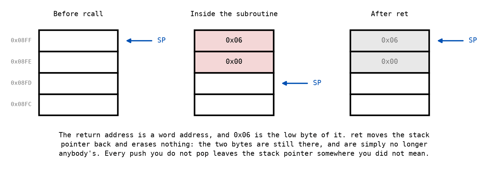
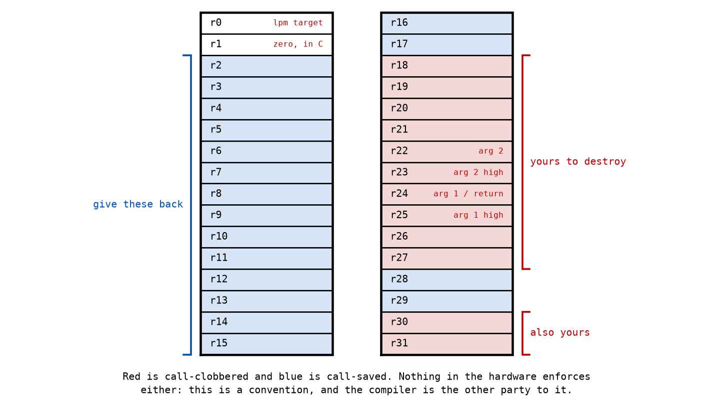

# Appendix B - Subroutines and the Calling Contract

## B.1 What rcall and ret actually do
`rcall` does two things: it pushes the address of the next instruction onto the stack, and it
jumps. `ret` pops that address back into the program counter. There is nothing else to it, and in
particular there is no frame, no argument list and no register saving.

Three facts in that figure are worth reading slowly, because all three are commonly got backwards.

**The address pushed is a word address.** The disassembler prints byte addresses, so an `rcall` at
byte `0x0A` returns to byte `0x0C`, and what goes on the stack is `0x0006`. Halving it is not a
detail you have to apply yourself anywhere in this course, but it explains a stack dump that
otherwise looks like it contains the wrong numbers.

**The low byte ends up at the higher address.** `SP` starts at `RAMEND` and decrements after each
byte, and the low byte goes first, so `RAMEND` holds the low byte and `RAMEND - 1` the high one.

**`ret` erases nothing.** It moves the stack pointer and leaves the bytes exactly where they were.
Everything below `SP` is not "empty"; it is stale, and the next `rcall` will overwrite it. A
program that reads below its own stack pointer finds the ghosts of previous calls, which is
occasionally a useful debugging trick and never a thing to rely on.

`rcall` costs 3 cycles and `ret` costs 4, so the cheapest possible subroutine call costs 7 cycles
before the subroutine has done anything. That is not an argument against subroutines; it is the
reason [L01's cross-check](../../L01/appendix/e_exercises.md) came out the way it did.

---

## B.2 The stack is one pointer and no protection
`SP` lives in `SPH:SPL`, at data space `0x5E:0x5D`, and it is the entire stack mechanism. Four
different things use it and none of them coordinates with the others:

* `rcall` and `ret`, for return addresses.
* `push` and `pop`, for whatever you decide to save.
* An interrupt, which pushes a return address whether you were expecting it or not (L03).
* Nothing else, because there are no local variables. If a subroutine needs memory, it either uses
  registers or you allocate it somewhere yourself.

The stack grows **downwards**, from `RAMEND` towards your variables. Nothing checks. A subroutine
that pushes without popping moves `SP` down permanently, and after enough calls the stack reaches
whatever you put at the bottom of SRAM and quietly overwrites it. There is no fault, no message
and no crash: just a variable that changes on its own.

**Every `push` needs its `pop`, in the opposite order.** That is not advice, it is the only thing
keeping `ret` pointed at a return address rather than at half of one.

---

## B.3 The calling contract
The hardware has no opinion about registers. Every convention below is a convention, and the
reason to follow it from the first lecture is that the C compiler follows it too, and in L06 the
two of you will be calling each other.

| Registers | Rule |
|---|---|
| `r18`-`r27`, `r30`, `r31` | **Call-clobbered.** A subroutine may destroy these. A caller that wanted one kept must save it itself. |
| `r2`-`r17`, `r28`, `r29` | **Call-saved.** A subroutine that uses one must `push` it on entry and `pop` it before `ret`. |
| `r24`, or `r25:r24` | First argument, and where a byte or word result is returned. |
| `r22`, or `r23:r22` | Second argument. |
| `r1` | Assumed to hold zero by compiled C. If you change it, put it back. |

So a driver subroutine taking a pointer and a pin number takes them in `r25:r24` and `r22`, and
this is why `shift_bits` used `r18` and `r19` for scratch in L01 rather than `r16` and `r17`.

**What breaks when you ignore it is nothing, for a while.** Inside this course's own library
everything is called from code you wrote, so a subroutine that clobbers `r16` merely surprises
you. The failure arrives in L06, when the caller is a C function that had a live variable in
`r16`, and the symptom is a value changing across a function call for no reason visible in the
source. That is among the least pleasant things this course can produce, and it is entirely
avoidable now.

---

## B.4 Calling a subroutine from a subroutine
The LED driver calls `shift_bits`, and `shift_bits` is a subroutine like any other, so two things
follow that are worth stating before you write the code.

**Anything call-clobbered is gone afterwards.** `shift_bits` destroys `r18`, `r19` and `r24`. A
driver that loaded a port register into `r18` and *then* called `shift_bits` gets the shift result
in `r18` and its port contents nowhere. So the read has to happen after the call, not before, and
that ordering is a pinned detail of [the specification](./c_led_driver.md), not a matter of taste.

**The stack grows by another two bytes.** A nested call is two return addresses deep. That is
fine here and it is worth knowing the depth, because from L03 an interrupt can arrive on top of
it and make it three.

**What does survive**, in this library, is `Z`. `shift_bits` never touches `r30` or `r31`, so a
driver can leave its structure pointer there across the call. Note that this is a fact about
`shift_bits`, not a guarantee from the contract: `Z` is call-clobbered, so a stricter subroutine
would be within its rights to destroy it. Relying on a specific routine's behaviour rather than on
the contract is a decision, and it is one you should make on purpose and write down.

---

## B.5 Passing a structure
The driver's five subroutines all operate on one LED, and there is more to an LED than fits in a
register: three 16-bit addresses and a bit number, seven bytes in all.

So the caller allocates those seven bytes somewhere in SRAM and passes the **address** in
`r25:r24`. The subroutine copies that pair into `Z` with one `movw`, and then reads any field it
wants with a single `ldd`, which takes a base register and a constant offset and costs the same
two cycles as a plain `ld`. One instruction per field, and the offset is the name from
`led.inc` rather than a number.

That is what makes two LEDs possible. Nothing in the driver knows how many exist; each call is
told which one to work on, and the answer lives in SRAM rather than in the code. The alternative,
a driver that hard-codes `PORTB` and bit 5, is shorter and works exactly once.

Where those seven bytes go is the caller's problem. In this lecture the tests place them at
`0x0200`, which is inside SRAM and well clear of the stack. L04 is where allocating them properly
becomes a topic in its own right.

**One warning about a pattern you will find in AVR code elsewhere**, including in the material
this course is based on: allocating driver structures at `RAMEND + 1`. On a device with external
RAM that is where external RAM starts. An ATmega328P on an Arduino Uno has none, so `RAMEND + 1`
is not memory at all, and storing there writes to nothing while reading gives nothing back. It
looks deliberate and it is a bug.

---

## B.6 Four instructions you need before L04 explains them
The driver in [Appendix C](./c_led_driver.md) reaches into a structure, and reaching into a
structure needs a pointer. L04 is where pointers are the subject; here is the minimum to write
this lecture's code without waiting for it.

| Instruction | Does | Cycles |
|---|---|---|
| `movw r30, r24` | Copies a register **pair** to a pair, so `r25:r24` into `Z` in one go | 1 |
| `ldd r18, Z+6` | Loads the byte 6 past where `Z` points, **without moving `Z`** | 2 |
| `std Z+6, r18` | Stores it back to the same place. The pointer comes first when storing | 2 |
| `adiw r26, 1` | Adds a small constant to a register pair, here stepping `X` on by one | 2 |

Three limits go with them, and each is a real constraint on how you write the driver rather than a
footnote:

* **`ldd` and `std` take a constant offset, at most 63.** It is encoded in the instruction, so it
  cannot come from a register. Every offset in `led.inc` is well under 63, which is not an
  accident.
* **`X` has no displacement form.** There is no `ldd r18, X+6`. So `Z` is the pointer for reaching
  into a structure and `X` is the pointer for holding an address you read out of one, which is
  exactly how the LED driver uses the two.
* **`adiw` takes at most 63 and works only on `r24`, `r26`, `r28` and `r30`**, the four pairs the
  instruction can name. Adding more than 63, or to any other pair, takes `subi` and `sbci` with the
  negated value instead.

Why any of this is shaped the way it is, and what the other addressing modes are for, is
[L04 Appendix A](../../L04/appendix/a_pointers.md).

---
