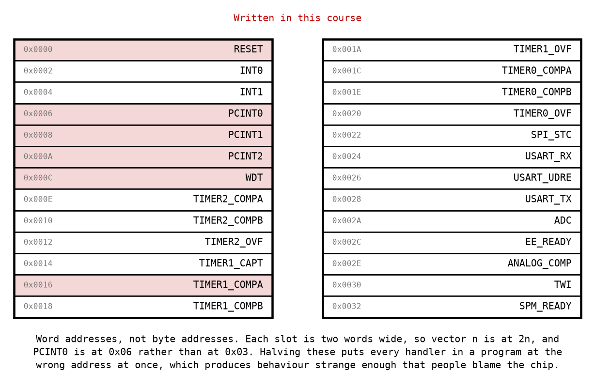
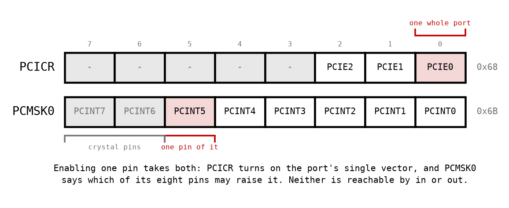

# Appendix A - Interrupts and the Vector Table

## A.1 What an interrupt is on this machine
An interrupt is a jump you did not write, taken between two instructions you did.

That is the whole of it. There is no scheduler, no thread, no context to switch. Some piece of
hardware sets a flag, the CPU finishes whatever instruction it was executing, pushes the program
counter, and jumps to a fixed address. Your handler runs, executes `reti`, and the program
counter comes back off the stack. The interrupted code has no way to know it happened.

Everything difficult about interrupts follows from that last sentence. Code that can be suspended
at any instruction boundary and resumed later is code you can no longer reason about one line at
a time, and [Appendix B](./b_isr_contract.md) is about what to do instead.

---

## A.2 The vector table
The first 52 words of program memory are not yours. They are a table of 26 slots, one per
interrupt source, and the hardware jumps to a fixed slot for each.



Three things about that table are worth having straight before you write anything.

**RESET is in it.** Vector 0 is the address the machine starts at, which is why a program's first
instruction has to be a jump to your code rather than the beginning of it: everything from word
`0x0002` upwards belongs to the table.

**Each slot is two words, so vector `n` is at word `2n`.** PCINT0 is vector 3 and lives at word
`0x0006`, not `0x0003`.

> **This course numbers the slots from zero**, so that RESET is vector 0 and the arithmetic is
> `2n` with nothing added. The datasheet's own table numbers them from **one**, so what it calls
> "Vector No. 4" is PCINT0, which is vector 3 here. The addresses are the same either way and only
> the index differs; the offset is worth knowing before you check one against the other.
 Two words, because a `jmp` on a part with 32 KB of flash is a two-word
instruction, and the table has to hold one even though a hand-written table usually puts a
one-word `rjmp` there and leaves the second word unused.

**A slot holds a jump, not a handler.** Two words is room for one instruction and nothing else, so
what goes in a slot is `rjmp` to wherever your handler actually is. There is one exception, and it
is a useful trick: a handler that fits in a single instruction can go directly in its slot, and
`reti` alone is a legitimate handler that does nothing but acknowledge the interrupt.

**The units already agree.** The datasheet's table is in words and AVRASM2 counts `.org` in
words, so the datasheet's number is the number you write: PCINT0 is at `0x0006` in the table and
`.org 0x0006` in your program. Nothing converts.

Better still, you need not write the number at all. `m328Pdef.inc` names every vector:

```asm
.org PCI0addr
    rjmp pcint0_isr
```

`PCI0addr` is `0x0006`, `WDTaddr` is `0x000c`, `OC1Aaddr` is `0x0016`, and the device file is the
one place any of them is written down. A table built from these names cannot drift from the
datasheet, because it *is* the datasheet.

> Assembly written for `avr-gcc` counts `.org` in **bytes**, so the same PCINT0 slot is reached
> by `.org 0x000C` there. If you are reading AVR assembly from elsewhere and every handler seems
> to sit at twice its address, that is the dialect you are looking at, not a bug
> ([L06 C.3](../../L06/appendix/c_c_abi.md#c3-calling-your-assembly-from-c) puts the two side by
> side).

**And a C program does not write a table at all.** Where `avr-gcc` links the program, avr-libc
supplies the whole vector table and a macro fills one slot in:

```c
ISR(TIMER1_COMPA_vect) { /* your handler */ }
```

That builds the same two words at the same address. The names are the difference: `avr-libc`
spells the slots `TIMER1_COMPA_vect` and `PCINT0_vect` where `m328Pdef.inc` spells them
`OC1Aaddr` and `PCI0addr`, and one file never has both. `ISR` also writes the handler's prologue
and epilogue for you, saving what the compiler used and ending in `reti`, which is convenient
right up to the point where you need to know exactly what was saved. `ISR(vect, ISR_NAKED)` gives
you the slot and nothing else: no prologue, no epilogue, no `reti`, and every one of B.2's rules
back in your hands. That is the form a kernel's tick handler takes, and it is worth recognising
now even though nothing in this course links a C program to a vector.

**Build this table yourself before reading it again**, in both units. The word address is the
vector number times two, and the byte address is twice that again; the byte addresses are what the
simulator's program counter holds, so you will want them the moment a test reports where something
actually landed.

---

## A.3 The one flag that controls all of them
Bit 7 of SREG, the `I` bit, is the global interrupt enable
([L01 A.3](../../L01/appendix/a_avr_core.md#a3-the-status-register)). With it clear, no interrupt
is served, whatever else is configured. `sei` sets it and `cli` clears it.

Enabling an interrupt therefore takes **two** switches, and forgetting either produces a program
that runs perfectly and never interrupts:

* the peripheral's own enable, which for a pin change interrupt is two more bits still (A.5);
* the global `I` bit.

`I` is not a convenience. The hardware clears it on entry to any handler and `reti` sets it again,
which is what stops a handler from being interrupted by the same interrupt that started it, and
what makes the blocked window in [B.5](./b_isr_contract.md#b5-how-long-are-interrupts-off) a real
quantity rather than a worry.

---

## A.4 What happens, in order


Two of those steps deserve more than the box gives them.

**"Finish the current instruction" is why latency is a range rather than a number.** The hardware
does not abandon an instruction half-done, so if the flag is set just as a four-cycle `ret`
begins, three more cycles pass before anything else happens. The shortest possible response is
therefore **6 cycles** with an `rjmp` in the table, and the longest is **9**.

**Both of those numbers assume an `rjmp` in the slot**, which is what this course writes. Four
cycles for the hardware's push, plus two for the jump, plus nought to three for the instruction
being finished. A table built with `jmp`, which is what `avr-gcc` emits because it has to reach
anywhere in flash, costs a cycle more at each end and the range is **7 to 10**. The vector jump
is a choice you make, so the entry latency is partly yours, and quoting one range without saying
which table it belongs to is how the two figures end up in the same argument.

**"One more instruction, then the next" is a guarantee, not an accident.** After `reti`, the AVR
always executes at least one instruction of the interrupted program before serving another
pending interrupt. Without that rule, a program under a steady stream of interrupts could make no
progress at all while appearing to run.

### What the simulator is and is not good for
Every other cycle count in this course was measured. These were not, and the reason is worth
stating plainly rather than hiding.

simavr charges a flat **4 cycles** of entry, where the datasheet's own figure is 4 for the push
plus however much of the current instruction was left to run. The instruction boundary itself is
modelled: the core finishes what it is executing and takes the interrupt between instructions,
which is why L05's own cross-check can explain a gap that alternates between
5332 and 5334 cycles by the two-cycle `rjmp` the flag had to wait for. What is not modelled is the
*variable* part of the entry: on the real device the wait depends on which instruction was
interrupted and how far into it the edge landed, and in the simulator it does not. So for this one
quantity the datasheet is the authority and the simulator is not, and the answer is arrived at by
reading rather than by measuring.

That is not a complaint about simavr, which is exact about the thing this course leans on hardest:
what an instruction costs. It is a reminder that a tool is trustworthy about specific things, and
that "I measured it" is only an argument when you know the tool models what you measured.

---

## A.5 Pin change interrupts
The ATmega328P has two kinds of external interrupt, and the difference matters.

`INT0` and `INT1` are two specific pins, each with its own vector, and each can be told to fire on
a rising edge, a falling edge, any change, or a low level. They are precise and there are two of
them.

**Pin change interrupts** cover 23 pins, which is very nearly every I/O pin on the part, including
the two that `INT0` and `INT1` already have, so a pin can have both kinds. They are a much blunter
instrument:

* **One vector per port**, not per pin. All eight pins of port B share `PCINT0`.
* **Any change fires it.** There is no edge selection: pressed and released both interrupt.
* **It does not tell you which pin.** The handler is given nothing at all beyond the fact that
  something on that port changed.



Enabling one pin takes both registers:

| Register | Address | What it does |
|---|---|---|
| `PCICR` | `0x68` | One bit per port: `PCIE0` for B, `PCIE1` for C, `PCIE2` for D. |
| `PCMSK0` | `0x6B` | One bit per pin of port B. `PCMSK1` and `PCMSK2` are C and D. |

Both are at `0x60` and above, which is **extended I/O**, so `in` and `out` cannot reach them and
`lds` and `sts` are the only way in
([L01 A.5](../../L01/appendix/a_avr_core.md#a5-the-io-window-two-names-for-one-register)). This is
the first place in the course where that distinction stops being trivia and starts being an
assembler error.

**So a handler for two buttons on one port has to ask each of them whether it was the one.** That
is exactly what `button_pressed` is for, and it is why the driver stores a structure per button
rather than a bit per port.

And there is one question the handler cannot answer at all: **which way the pin went**. The
interrupt fires on press and on release, and by the time the handler reads the pin the answer it
gets is the pin's state now, which for a fast enough press may already be the other one. The usual
fix is to compare against the previous state, kept in a variable, which is a variable shared
between a handler and everything else, which is [Appendix B](./b_isr_contract.md).

---
