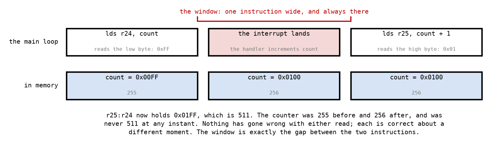

# Appendix B - The ISR Contract, and Atomicity

## B.1 What the hardware saves
The program counter. That is the complete list.

Not SREG. Not any register. Not the pointer registers. Everything else your handler touches, it
destroys, and the interrupted code has no idea it was interrupted and will carry on using whatever
it had.

This is the difference between an interrupt handler and a subroutine, and it is not a small one. A
subroutine has a caller who agreed to a contract: `r18` to `r27` are clobbered, and a caller who
wanted one kept saved it first
([L02 B.3](../../L02/appendix/b_subroutines.md#b3-the-calling-contract)). A handler has no caller.
It interrupts code that agreed to nothing, could not have agreed to anything, and does not know
it happened.

**So a handler must save everything it uses, and restore all of it.** Not the call-saved half:
everything.

---

## B.2 SREG first, and SREG last
The subtlest part is not a register at all.

The interrupted code may have been between a `cp` and its `brne`
([L01 A.3](../../L01/appendix/a_avr_core.md#a3-the-status-register)). The flags are live at that
instant, in the strongest sense: they are the entire result of the comparison, and they have one
instruction left to live. A handler that executes any arithmetic at all overwrites them, and the
branch afterwards then tests the handler's flags instead of the comparison's.

The symptom is a branch that goes the wrong way occasionally, and only under load, and never when
you are watching. It is among the least pleasant bugs this course can produce.

So a handler's prologue and epilogue have a fixed shape, and the order is not negotiable. On the
way in:

1. **Push a register**, one you are willing to work in.
2. **Read `SREG` into it** with `in`, before anything has had a chance to change the flags.
3. **Push that too**, so the flags are on the stack.

Then your handler does whatever it likes. On the way out, the mirror image:

4. **Pop the saved flags** back into the register.
5. **Write them to `SREG`** with `out`, before anything can disturb them again.
6. **Pop the register** back to what the interrupted code had in it.
7. **`reti`**.

**Save the register before reading SREG**, because `push` writes no flags but you need somewhere
to put SREG and taking it costs you a register you have not saved yet. **Restore SREG before the
final `pop`**, for the same reason in reverse: `pop` writes no flags either, so this order works,
and an order that puts an arithmetic instruction between the `out` and the `reti` does not.

`in` and `out` are the right instructions here: SREG is at data space `0x5F`, which is I/O address
`0x3F`, inside the low 64 that `in` and `out` reach, and they cost one cycle where `lds` and `sts`
cost two. Two cycles saved on every interrupt, on the one path where it matters most, and
two words of flash on top of that.

---

## B.3 Registers, and the cost of a handler
Beyond SREG, save every register your handler writes, including any that a subroutine you call
will clobber. That last part catches people: a handler that calls `button_pressed` has to save
`r18`, `r19`, `r24` and `r25` even though it never names `r18` itself, because the subroutine does.

Each `push` is 2 cycles and each `pop` is 2, so a saved register costs 4 cycles for the round trip
and one byte of stack. A handler saving four registers plus SREG makes five pushes and five pops:
with the `in` and the `out` around them that is 11 cycles before it does anything and 11 more on
the way out, 22 in all.

That is the argument for short handlers, and it is worth being precise about what "short" buys
you, which is [B.5](#b5-how-long-are-interrupts-off).

---

## B.4 The shared variable
A handler and the main loop that share a variable are two pieces of code with no synchronisation
between them, and on an 8-bit machine any variable wider than one byte is read and written in
pieces.



The main loop assembled `0x01FF`, which is 511. The counter was 255 and then 256. It was never
511, at any instant, and no amount of reading the two `lds` instructions will show you anything
wrong: each of them read the correct value of the byte it read, at the moment it read it.

**The window is exactly the gap between the two instructions**, which for two `lds` is 2 cycles.
At 16 MHz that is 125 ns, and the chance that any one read is torn is that window times the rate at
which the handler actually fires: at 1 kHz, about one read in eight thousand. Which means it
happens, and it happens rarely, and it will not happen while you are watching.

The fix is to make the read atomic by preventing the interrupt during it: `cli` before the two
loads and `sei` after them.

Two instructions and two cycles to close it. Note what `cli` and `sei` are doing here: they are
not protecting the *counter*, they are protecting the *pair of reads*. The handler is free to
change the counter at any other time.

**And note the bug this fix has.** That sequence unconditionally enables interrupts at the end. If
the code calling it had interrupts disabled for its own reasons, they are now on. The correct
version reads `SREG` into a spare register first, clears the flag, does the two loads, and writes
that register back to `SREG`; the same prologue and epilogue as B.2, for the same reason. It costs
one cycle more, not zero: `cli` plus `sei` is 2 cycles, and `in` plus `cli` plus `out` is 3. The
`cli` does not go away; only the `sei` does.

**And the failure that follows from the same bug, one level up.** Nest two of these. The outer one
does `cli`, and part-way through it calls something that does `cli` … `sei`. The inner section ends
by turning interrupts *on*, in the middle of the outer section, which now runs unprotected to its
end and has no way to find out. The `sei` version is not merely impolite to its caller; it is
impossible to compose with itself. Save-and-restore composes, because each level hands back the
flag it was given, and that is the whole reason a kernel's critical sections cannot be `cli`/`sei`
either.

**A single byte needs none of this.** `lds r24, flag` is one instruction, and an interrupt cannot
land in the middle of one. That is why an 8-bit flag shared between a handler and a main loop is
safe and a 16-bit counter is not, and it is worth knowing which of your variables is which.

---

## B.5 How long are interrupts off
The hardware clears `I` before it pushes the program counter and `reti` sets it again. So the
window in which no other interrupt can be served is:

```math
\text{blocked} = 4 \;+\; \text{vector jump} \;+\; \text{your handler, reti included}
```

Four for the push, two more for an `rjmp` in the table, and then everything you wrote. Six cycles
are the hardware's and the rest is yours.

On the reference implementation, the button handler measures **88 cycles when the button is not
pressed and 147 when it is**, so it blocks interrupts for **94** or **153** cycles, which is
5.875 µs or 9.5625 µs at 16 MHz. Whether that is a lot depends entirely on what else is waiting;
`avr::interrupt::Vectors::blockedCycles` is how you find out for your own handler, and
[Appendix D](./d_exercises.md)'s cross-check is where you check the answer against a measurement.

**What being blocked costs is lateness, not loss.** A pin change interrupt sets a flag, and the
flag stays set until it is served, so a second interrupt arriving during your handler is delayed
rather than dropped. What *is* lost is a second change on the same port during that window: the
flag is one bit, and it is already set.

---

## B.6 What a handler must not do
**Do not call anything long.** Not because it is bad style, but because
[B.5](#b5-how-long-are-interrupts-off) is a number and calling a delay routine makes it enormous.

**Do not busy-wait for anything an interrupt would have to deliver.** Interrupts are off. The
thing you are waiting for cannot arrive, and the machine will sit there until the watchdog
(L06) rescues it, or until somebody unplugs it.

**Do not `sei` inside a handler**, unless you have thought about it very hard. It lets the same
interrupt interrupt itself, and the stack grows by one frame each time. Two frames is fine. Two
thousand frames is your variables overwritten from the top down, with no fault and no message
([L02 B.2](../../L02/appendix/b_subroutines.md#b2-the-stack-is-one-pointer-and-no-protection)).

**Do not assume it runs once per event.** A mechanical button bounces
([L02 A.5](../../L02/appendix/a_io_ports.md#a5-a-button-and-why-pressed-reads-zero)), and a pin
change interrupt fires on every one of those transitions. A handler that toggles an LED on each
press will toggle it four or five times per press, and the LED will appear to respond about half
the time. That is not a fault in your handler and no amount of rereading it will help.

**And do not forget it can happen between any two instructions of anything.** Including between
the two `lds` of B.4, and including inside a subroutine the main loop was halfway through.

---
