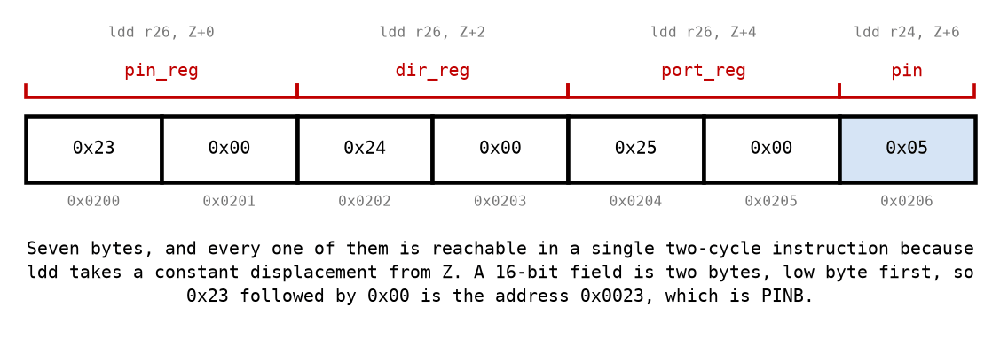
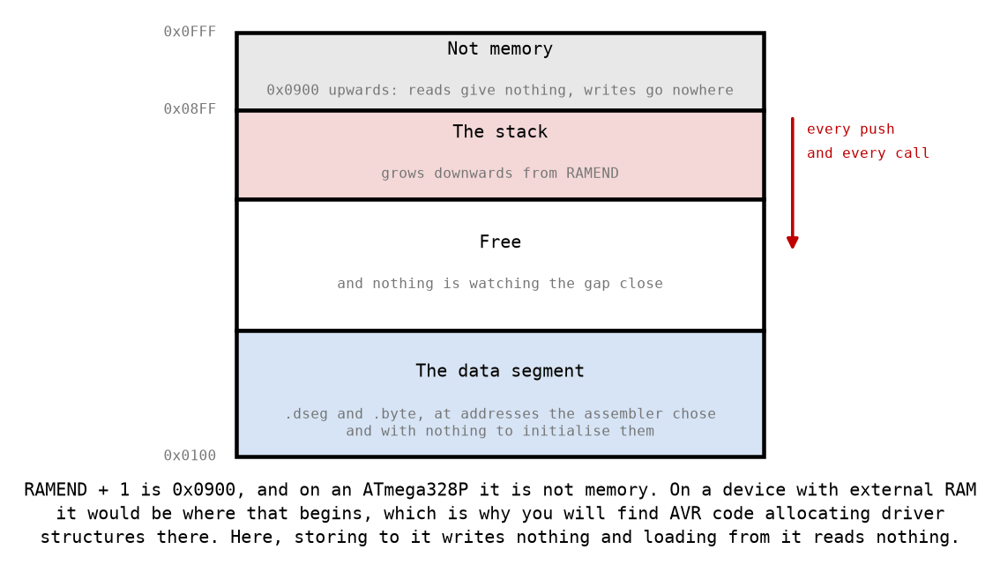

# Appendix B - Structures, Arrays, and Where They Live

## B.1 A structure is an agreement
There is no `struct` here. There is an address, some bytes after it, and an agreement between
your code and itself about which byte means what.



That is L02's LED structure after `led_init` has run for Arduino pin 13. Four things in it are
worth saying out loud, because in C the compiler would say them for you:

**A 16-bit field is two bytes, low byte first.** `0x23` followed by `0x00` is the address
`0x0023`, which is `PINB`. Read the two bytes in the other order and you get `0x2300`, which is
not memory at all, and the driver will store through it without complaint
([B.4](#b4-where-a-structure-may-live)).

**The offsets are the interface.** They are declared once, in
[`drivers/include/led.inc`](../../../drivers/include/led.inc), and both your driver and the test
suite read them from there. A structure whose fields are in different places is a different
structure, however similar the code looks.

**Every field is one instruction away.** All four offsets are below 63, so `ldd` and `std` reach
any of them directly ([A.3](./a_pointers.md#a3-displacement-and-its-two-limits)). That is the
whole design: a driver copies the structure address into `Z` once and then never does pointer
arithmetic again.

**Nothing checks the type.** A button structure begins with an LED structure's three pointers, at
the same offsets, so `led_on` will accept one and find three plausible port registers in it. The
fourth field is where they part: offset 6 is the LED's `pin` and the button's `pcmsk_reg`, so
`led_on` reads a pin number of `0x6B`, shifts by that, gets a zero mask, writes nothing and
reports success. There is no type system here; there is only what you passed, and the failure is
silence rather than an error.

---

## B.2 An array is a stride
An array of structures is a run of them, one after another, with nothing in between. To get from
one to the next you add the structure's **size**, and on this device that means:

* the LED structure's stride is **7**,
* the button structure's stride is **10**.

Neither is one, and neither is a power of two, and both of those facts have consequences.

**Adding 7 is not incrementing.** Walking an array is `adiw` by the structure size, or the
`subi`/`sbci` pair when the size is over 63. It is not `Z+`, which advances by one byte and would
put the second structure's first field on top of the first structure's second field.

**Indexing needs a multiply.** The address of entry `n` is the base plus `n` times the stride, and
`7 × n` is not a shift. The AVR does have a hardware `mul`, which costs two cycles and leaves its
result in `r1:r0`; using it means remembering to clear `r1` afterwards, because compiled C assumes
`r1` holds zero ([L02 B.3](../../L02/appendix/b_subroutines.md#b3-the-calling-contract)). The
alternative is to walk from the start, which costs a loop and no surprises.

**A wrong stride is not an error.** It is a second structure that overlaps the first, and the
symptom is one LED that works and a second that behaves like a corrupted copy of it. There is
nothing to catch it: every address involved is a legal address, and every store succeeds.

---

## B.3 Passing an array
A subroutine that works on an array needs three things, and this course passes them in the
argument registers the calling contract gives it: the **base address** in `r25:r24`, the **count**
in `r22`, and, where there is one, an **index** in `r20`.

The count is not optional and it is not a courtesy. Nothing in memory marks where an array ends;
the byte after the last structure is an ordinary byte that will read as a plausible structure. A
subroutine that walks until something looks wrong walks forever.

**So every loop over an array tests its count at the top, not the bottom.** A count of zero is a
real input, it means "do nothing", and a loop that tests at the bottom does one entry anyway.
That is the single most common array bug, it is invisible for every other count, and
[the test suite](../exercises/test/README.md) has a case for exactly it.

---

## B.4 Where a structure may live


An ATmega328P has 2048 bytes of SRAM, from `0x0100` to `0x08FF`. Above and below that are
addresses that a store instruction will accept and that are not memory you may use:

| Address | What it is | What a store does |
|---|---|---|
| `0x0000` to `0x001F` | the register file | changes a register, quietly |
| `0x0020` to `0x005F` | the I/O registers | reconfigures the hardware |
| `0x0060` to `0x00FF` | extended I/O | the same |
| `0x0100` to `0x08FF` | SRAM | what you wanted |
| `0x0900` upwards | **nothing** | goes nowhere; a load reads nothing back |

**`RAMEND + 1` is the one to know about.** It is `0x0900`, it looks like the obvious place to
start putting things, and a good deal of published AVR code allocates driver structures there,
including the material this course is based on. On a device with external RAM it *is* where that
RAM begins. On an ATmega328P on an Arduino Uno there is no external RAM, so it is nothing at all:
the stores succeed, the loads return nothing, and the driver behaves as though every structure
were full of zeros.

The right answer is to let the assembler place them. AVRASM2 has a data segment for exactly this:
`.dseg` switches to it, `label: .byte n` reserves `n` bytes and gives you the address the assembler
chose, and `.cseg` switches back. Two reservations cannot overlap, and neither occupies a byte of
flash, because nothing in the data segment is emitted: it is an address allocator and nothing
more.

```asm
.dseg
my_led:     .byte LED_SIZE
my_button:  .byte BTN_SIZE
.cseg
```

**Nothing zeroes it for you.** `.bss` in a C program is cleared by startup code that runs before
`main`, and there is no startup code here: `avra` has no linker and no runtime, so the bytes hold
whatever the SRAM powered up with. Every field a driver reads before it has written is a field you
initialised or a field that is garbage. That is what `led_init` is for.

Hard-coding `0x0200` works too and is what the test suite does, because a test wants to know
exactly where it put something; in a program, letting the assembler do it is one fewer number to
keep consistent.

**Whichever you choose, the arithmetic in [Appendix C](./c_stack.md) is still yours to do.**
Nothing on this device notices when your variables and your stack meet.

---
