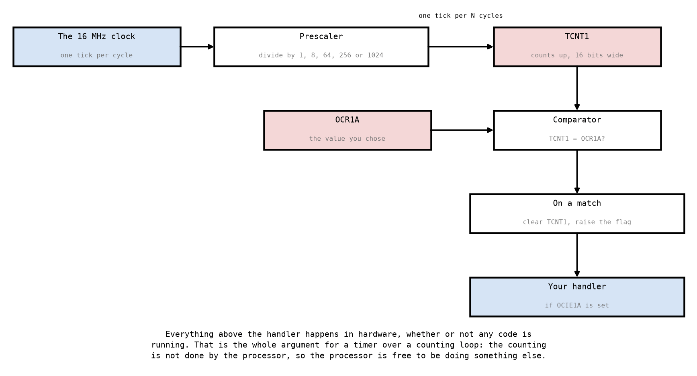
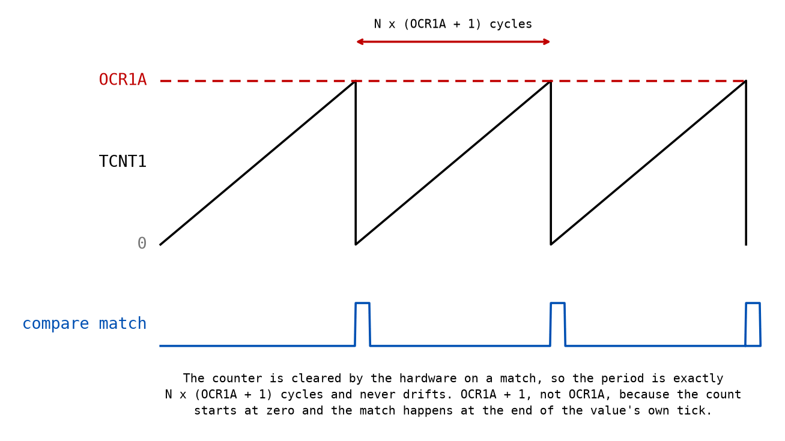
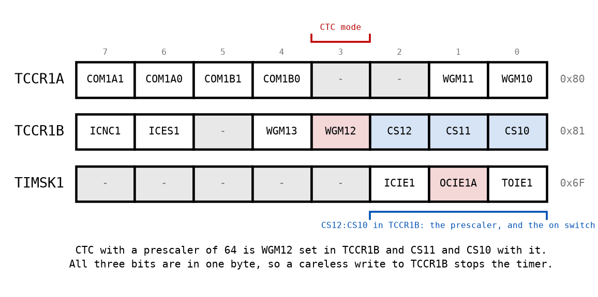

# Appendix A - Timers

## A.1 What is wrong with counting
L02 ended with an LED toggling about 127,000 times a second, because nothing was slowing it down
(L02 F.9, exercise 9). The obvious fix is a
loop that counts to a large number and does nothing, and it works.

It is still the wrong answer, for three reasons that are worth separating.

**The processor is doing nothing, and it is doing it at full speed.** Sixteen million cycles a
second spent decrementing a register. Anything else the program wants to do has to be interleaved
into that loop by hand, and every such thing changes the delay.

**The delay is only right if you counted correctly.** A counting loop's duration is an arithmetic
claim about instructions, and every edit to the loop invalidates it
([L01 C](../../L01/appendix/c_counting_cycles.md)).

**And an interrupt makes it wrong anyway.** A handler that fires during the loop adds its own
cycles to the delay, at a moment nothing predicts
([L03 B.5](../../L03/appendix/b_isr_contract.md#b5-how-long-are-interrupts-off)). The more your
program does, the less accurate its delays become, which is precisely backwards.

A timer has none of those problems, because the counting is not done by the processor.

---

## A.2 The hardware


Four pieces, and only two of them are yours to choose.

**The prescaler** divides the system clock, so the counter advances once every N cycles rather
than every cycle. Five ratios are available: **1, 8, 64, 256 and 1024**. That is Timer0's and
Timer1's set; Timer2 has a different and longer one, and every calculation in this lecture assumes
the five ([A.3](#a3-why-the-prescaler-exists)).

**The counter**, `TCNT1`, counts up. Timer1's is 16 bits wide, which is what makes it the useful
one; Timer0 and Timer2 have 8-bit counters.

**The compare register**, `OCR1A`, holds a value you choose. Hardware compares the counter
against it continuously.

**On a match**, in CTC mode, the hardware clears the counter and raises a flag. If `OCIE1A` is
set in `TIMSK1` and interrupts are enabled globally, that flag becomes an interrupt.

Everything above the handler happens whether or not any of your code is running. That is the
whole argument: the counting continues while the processor is doing something else, including
while it is inside a different interrupt handler.

---

## A.3 Why the prescaler exists
A 16-bit counter at 16 MHz overflows in about four milliseconds. Anything slower than 244 Hz is
out of reach without help, and the help is the prescaler.

The ratios are **1, 8, 64, 256 and 1024**, and the step between them is not constant. Write the
four steps out and the shape is obvious:

```text
    1 -> 8      x8
    8 -> 64     x8
   64 -> 256    x4
  256 -> 1024   x4
```

Two eights and then two fours. That matters more than it sounds. When a frequency does not fit at
one prescaler, the next one up multiplies your available period by eight at the bottom of the
ladder and by four at the top, so "try the next one" is not a smooth adjustment and the number of
ticks you end up with jumps around.

**These five are Timer0's and Timer1's.** Timer2 selects from **1, 8, 32, 64, 128, 256 and 1024**,
because it is the timer meant to be driven from a watch crystal and needs the extra steps to reach
a second from 32.768 kHz. Nothing in this course uses Timer2, and mixing its ladder into any
calculation below would give a wrong answer that still looks plausible, which is why
`atmega328p.hpp` pins the five and says in its comment which timers they belong to.

**A prescaler is a loss of resolution, not just a change of range.** At a prescaler of 64 the
counter advances once every 64 cycles, so the finest period you can express is 64 cycles. Every
frequency you can reach is a multiple of that, and everything between two of them is unavailable.
That is the whole of [Appendix B](./b_frequency.md).

---

## A.4 CTC mode


CTC is **Clear Timer on Compare**: the counter counts up to `OCR1A` and the hardware clears it.
So the period is:

```math
T = \frac{N \times (\mathrm{OCR1A} + 1)}{f_{\mathrm{clk}}}
```

**`OCR1A + 1`, not `OCR1A`.** The counter starts at zero, so counting to 249 visits 250 values.
Writing the tick count itself instead of one less gives a period one tick too long, every period,
which is 0.4% at 250 ticks and invisible at 16000. It is the single most common mistake in timer
setup and it produces a clock that is slightly slow rather than obviously broken.

**The period does not drift.** The hardware clears the counter, so nothing accumulates. A
software delay of a million cycles that is one cycle out is one cycle out every time and an hour
later you are seconds behind; a CTC period that is exactly `N × (OCR1A + 1)` stays exactly that,
for as long as the power is on.

The alternative, **normal mode**, lets the counter run to its maximum and wrap, interrupting on
overflow. The period is then fixed by the counter's width and the prescaler, and the only thing
you can choose is the prescaler. It is simpler and much less useful, and it is what you fall back
to on a timer with no compare register.

---

## A.5 The registers


Four registers, and one caution.

| Register | Address | What you put in it |
|---|---|---|
| `TCCR1A` | `0x80` | Zero, for CTC with no pin output. |
| `TCCR1B` | `0x81` | `WGM12` for CTC, and the three clock select bits. |
| `OCR1A` | `0x88` | The compare value, two bytes, low byte first. |
| `TIMSK1` | `0x6F` | `OCIE1A`, to let the match interrupt. |

**All four are at `0x60` or above**, which is extended I/O, so `in` and `out` cannot reach any of
them and `lds` and `sts` are the only way in
([L01 A.5](../../L01/appendix/a_avr_core.md#a5-the-io-window-two-names-for-one-register)). Unlike
the port registers, getting this wrong is an assembler error rather than a silent one.

**The clock select bits are the on switch.** `CS12:CS10` choose the prescaler *and* whether the
timer runs at all: all three zero means stopped. They live in the same byte as `WGM12`, so a
careless write to `TCCR1B` that means to change the mode also stops the counter, and a timer that
has stopped looks exactly like a timer whose interrupt was never enabled.

**Write `OCR1A` high byte first.** The 16-bit registers are reached through a shared temporary
byte in the hardware, and the datasheet's rule is: write the high byte first, read the low byte
first. Getting it backwards is not a race and is not occasional: the low-byte write is the one
that commits, so it latches whatever stale value `TEMP` was already holding into `OCR1AH`, and the
high-byte write that follows goes into `TEMP` and never reaches the register at all. It is wrong
every time, deterministically, for any value whose high byte is not already correct. This course's
arithmetic does not depend on it and the simulator will not punish you; a real device will.

---

## A.6 What a timer does not solve
**It does not make your handler punctual.** The compare match is exact; the moment your code runs
is not, because the interrupt still waits for the current instruction and the response still
takes its four cycles ([L03 A.4](../../L03/appendix/a_interrupts.md#a4-what-happens-in-order)).
The period is exact and each individual arrival is not, which is
[Appendix D](./d_exercises.md)'s cross-check.

**It does not give you more timers.** There are three, one of them 16-bit, and the Arduino
environment has already claimed Timer0 for its own timekeeping if you are sharing a board with
it. Wanting four independent rates from three timers is normal, and the answer is
[C.4](./c_what_to_build.md#c4-what-to-build-in-assembly-driverssourcetimerasm).

**And it does not stop while you debug.** A timer keeps counting when the processor is halted at
a breakpoint, so a program stepped through by hand sees a flood of pending interrupts the moment
it resumes. Nothing in this course does that, and it is the first thing that will confuse you on
real hardware with a debugger attached.

---
