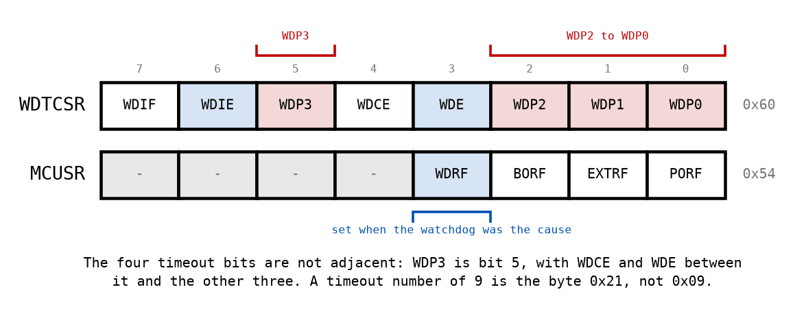
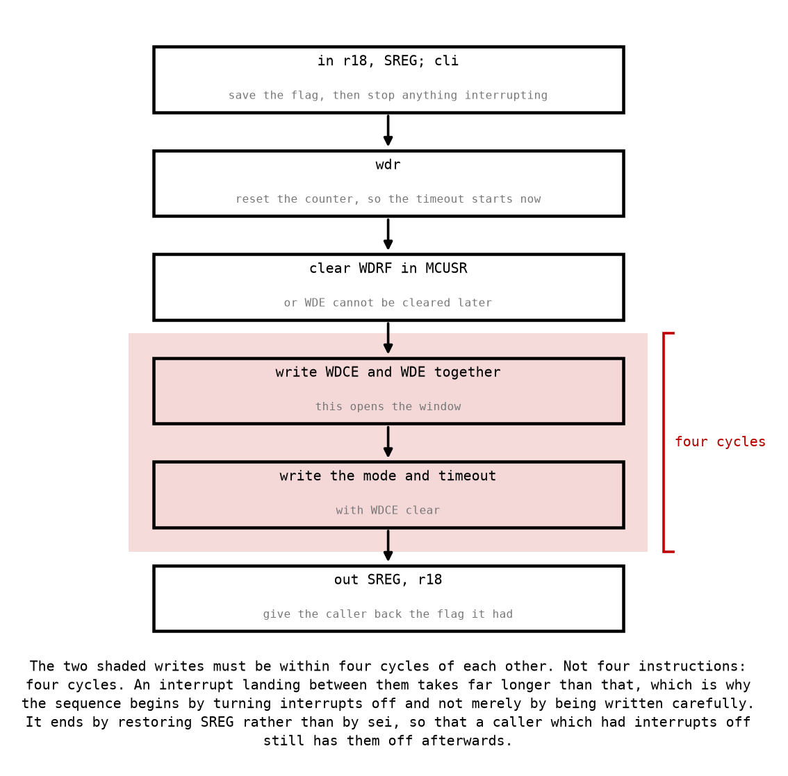

# Appendix A - The Watchdog

## A.1 What it actually detects
A watchdog is a timer that resets the device unless your program keeps telling it not to. That is
the whole mechanism, and everything useful and everything disappointing about it follows from
that one sentence.

**It detects exactly one thing: that your program stopped reaching the instruction that pets it.**

So it catches a program stuck in a loop that never exits, a program blocked waiting for an
interrupt that will never arrive, and a program that jumped somewhere meaningless and is executing
whatever it found. Those are real failures and they are the ones hardest to catch any other way.

Here is what it does **not** catch, and the list is longer:

* **A program computing wrong answers quickly.** It is petting the watchdog on schedule and is
  completely broken.
* **The atomicity bug from L03.** The main loop reads a torn 16-bit value and carries on. Nothing
  is stuck.
* **A stack that has grown into your variables**, right up until it corrupts a return address and
  the program jumps somewhere that stops petting
  ([L04 C.3](../../L04/appendix/c_stack.md#c3-what-running-out-looks-like)).
* **A driver writing to the wrong port register.** The program runs perfectly and the hardware
  does the wrong thing.
* **Anything about correctness at all.**

And it introduces a failure of its own: **a program that pets the watchdog from inside the wrong
place.** A handler that runs on a timer and pets the watchdog will keep petting it while the main
loop is completely stuck, which converts a watchdog from a safety mechanism into decoration. Pet
it from one place, in the main loop, at the point that proves the whole loop ran.

---

## A.2 The two modes
The watchdog can do one of two things when it times out, and it is worth being clear that these
are different tools.

**System reset**, with `WDE` set. The device restarts as though it had been power cycled, except
that SRAM keeps its contents and `MCUSR` records that the watchdog was the cause. This is the one
you want in a product.

**Interrupt**, with `WDIE` set. The timeout raises the `WDT` interrupt instead, and your handler
runs. Nothing is reset. This is useful for waking from sleep
([Appendix B](./b_sleep.md)) and for recording diagnostics before a deliberate reset, and it is
**not** a safety mechanism, because a program too broken to pet the watchdog is usually too broken
to run a handler sensibly.

Both bits can be set at once, which the datasheet calls interrupt-and-reset mode: the first
timeout interrupts, and because the hardware clears `WDIE` on entry, the second one resets. That
gives you one chance to save something before the restart.

---

## A.3 The registers

| Register | Address | Holds |
|---|---|---|
| `WDTCSR` | `0x60` | The timeout selector, `WDE`, `WDIE`, and the window bit `WDCE`. |
| `MCUSR` | `0x54` | Why the last reset happened: power-on, external, brown-out, or watchdog. |

**`WDTCSR` is in extended I/O and `MCUSR` is not**, so the first needs `lds` and `sts` and the
second can use `in` and `out`. Two registers in one subroutine, two addressings.

**The timeout selector is four bits that are not next to each other.** `WDP3` is bit 5, and
`WDP2` to `WDP0` are bits 2 to 0, with `WDCE` and `WDE` in between. The datasheet numbers the
timeouts 0 to 9, and **that number is not the byte you write**:

| Timeout | Selector | Byte |
|---|---|---|
| 16 ms | 0 | `0x00` |
| 125 ms | 3 | `0x03` |
| 2 s | 7 | `0x07` |
| 4 s | 8 | **`0x20`** |
| 8 s | 9 | **`0x21`** |

**Writing `0x08` because you wanted four seconds is the most expensive typo in this lecture.**
`0x08` is `WDE` with the selector left at zero, so it means "reset me if I go quiet for sixteen
milliseconds". For most programs that is immediately, and for ever: the device resets, runs a few
hundred microseconds of startup, and resets again. Reprogramming it then means winning a race
against the watchdog, which is possible and unpleasant.

Nobody remembers that table, and nobody should try to. What is worth remembering is its shape:
the four selector bits are not contiguous, so the byte is never the timeout number.

---

## A.4 The timed write sequence
The watchdog is the one peripheral on this device that refuses to be configured carelessly, and
the reason is that a program which has gone wrong must not be able to switch off the thing that
would rescue it.

So changing `WDE` or the timeout takes two writes:

1. Write `WDCE` and `WDE` **together**. This opens a window.
2. Within **four cycles**, write the value you actually want, with `WDCE` clear.

Four cycles, not four instructions. Two consecutive `sts` instructions are two cycles each, so
they fit with one cycle to spare: a single `nop` between them still works, and anything longer does
not.

**This is why the sequence starts with `cli`.** An interrupt landing between the two writes takes
at least six cycles to reach your handler and then runs the whole thing
([L03 A.4](../../L03/appendix/a_interrupts.md#a4-what-happens-in-order)). The window would be long
gone. Turning interrupts off is not defensive style here; it is the only way the sequence can be
made to work at all.

**And it is why `WDRF` must be cleared first.** The hardware will not let you clear `WDE` while
`WDRF` is set in `MCUSR`. That rule exists so that a device which has just been reset by the
watchdog cannot immediately disable it and carry on being broken. The consequence for you is
specific: a driver that forgets to clear `WDRF` works perfectly the first time it runs and cannot
switch the watchdog off after a watchdog reset, which is precisely when you most want to.

### What a failed sequence leaves behind
If the second write misses its window, the hardware ignores it. `WDCE` clears itself after four
cycles, and what remains is whatever the *first* write was allowed to change on its own: `WDE` is
set, because setting it never needs the window, and the timeout selector is where it was, because
changing it does. On a device fresh from reset the selector is zero, so the register holds `0x08`.

That is system reset mode with the shortest timeout. **A sequence that is merely slightly too slow
does not fail safe; it fails into system reset mode, and from reset into the most aggressive
setting the register has.** The simulator models this exactly, and the test suite checks for it:
if `WatchdogDriver.InitWritesTheByteAsked` ever reports `WDTCSR` holding `0x08`, that is what
happened.

---

## A.5 Choosing a timeout
Ten timeouts, from 16 ms to 8 s, roughly doubling. The choice is a genuine engineering decision
with a cost in both directions:

**Too short** and the watchdog fires during normal operation, on the one iteration that took
longer than usual. A program that resets itself occasionally under load is far worse than one that
does not have a watchdog at all, because now you are debugging the watchdog as well.

**Too long** and a program that has stopped stays stopped for that long. Eight seconds is a long
time for a machine to be doing nothing.

The rule is: **the shortest timeout that comfortably exceeds your worst-case loop time**. Worst
case, not typical: the iteration that reads a sensor, and handles two interrupts, and takes the
slow branch.

**And the timeouts are nominal.** They come from an internal oscillator that runs at roughly
128 kHz and varies with supply voltage and temperature. The datasheet's "1.0 s" and the "1024 ms"
you will find in other people's code are the same setting described two ways, and neither is a
promise. Leave real margin, and do not build anything on the exact value.

---
