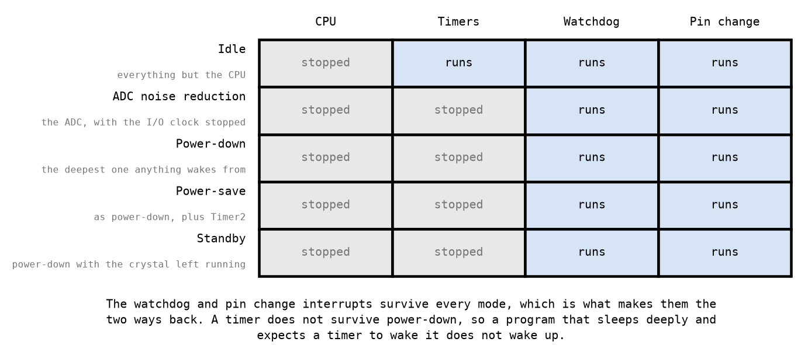

# Appendix B - Sleep

## B.1 What sleeping is
`sleep` is an instruction that stops the processor until something wakes it. What "something" can
be, and what else stops alongside the processor, depends on the mode you selected first.

The point is power. An ATmega328P running flat out at 16 MHz draws on the order of ten
milliamps; in power-down it draws microamps. For anything battery powered that is the difference
between days and years, and it is available to any program whose main loop is mostly waiting.

**Sleeping is not idling.** A main loop that spins doing nothing is running at full speed and
full current. Replacing that spin with `sleep` changes nothing about the program's logic and
everything about its power, which makes it one of the few genuinely free improvements in embedded
work, provided you choose the mode correctly.

---

## B.2 Setting it up
Two registers and one instruction.

`SMCR` holds the mode in `SM2:SM0` and the enable in `SE`. `SE` must be set for `sleep` to do
anything at all, and the datasheet's advice is to set it immediately before the `sleep` and clear
it immediately after, so that a stray `sleep` reached by accident does nothing.

The layout is one byte with three bits that matter and one that switches it on:

```text
    bit    7   6   5   4   3   2   1   0
           -   -   -   -  SM2 SM1 SM0  SE
```

`SE` is bit 0 and the mode occupies bits 3 to 1, which means the mode is the encoding **shifted
left by one**: power-down is `SM2:SM0 = 010`, so the byte is `0x04`, and `0x05` with `SE` set.
Power-down written without that shift, `010` with `SE` beside it, is `0x03`: ADC noise reduction,
one mode too shallow, and the program still sleeps, which is why this is worth writing down rather
than deriving each time.

`SMCR` is inside the I/O window, so `in` and `out` reach it, unlike the watchdog's register: it is
data address `0x53` and I/O address `0x33`, and the name in `m328Pdef.inc` is the second
([L01 A.5](../../L01/appendix/a_avr_core.md#a5-the-io-window-two-names-for-one-register)).

The sequence is: choose the mode, set `SE`, execute `sleep`, and clear `SE` when you wake. What
wakes you runs its interrupt handler first, and then execution continues at the instruction after
the `sleep`.

---

## B.3 What each mode leaves running


The datasheet gives this as a dozen clock domains. Four of them decide whether a given program can
use a given mode, and they are the four in that figure.

**Idle** stops the CPU and nothing else. Every peripheral keeps running and any interrupt wakes
you. It saves the least and costs nothing in capability, and it is what most programs should use
first.

**ADC noise reduction** stops the CPU and the I/O clock but leaves the ADC running, so a
conversion happens with the digital noise switched off. It exists for one job and this course does
not do that job; it is in the figure because it sits between idle and power-down in the `SM2:SM0`
encoding and you will meet it in the datasheet's table.

**Power-down** stops nearly everything, including the main clock, and is where the large savings
are. The consequence is the important part: **a timer cannot wake you from power-down**, because
the timer's clock has stopped too.

**Power-save** is power-down with Timer2 left running, if Timer2 has been set up to run
asynchronously from a separate crystal. That is the arrangement for a device that must sleep
deeply and still keep time, and it is why Timer2 exists in the form it does. **An Arduino Uno has
no such crystal**, so on the board this course assumes, power-save wakes from exactly what
power-down wakes from and costs the same to leave; the mode is real and the reason to choose it
is not fitted.

**Standby** is power-down with the crystal oscillator left running, so waking is faster. It costs
more current than power-down and less than idle. **Extended standby** is the same trade applied to
power-save, and the figure leaves it out for space: six modes fit in `SM2:SM0` and five of them
fit on a page.

So the ladder is six modes deep, from idle through ADC noise reduction, power-down, power-save and
standby to extended standby, and the two that matter for anything in this course are the first and
the third.

---

## B.4 The two things that always wake you
**A pin change interrupt**, because it is asynchronous: the pin changing is itself the signal, and
no clock is needed to notice it. That is the mechanism behind a device that sleeps until a button
is pressed.

**The watchdog**, because it runs from its own oscillator and does not care what else has stopped.
Configure it in interrupt mode ([A.2](./a_watchdog.md#a2-the-two-modes)), sleep, and the timeout
wakes you.

Those two together are the whole toolkit for a low-power device: **sleep until something happens,
or until the watchdog says enough time has passed.** A program that wants to do something every
eight seconds and nothing in between can do exactly that, and spend almost all of its life drawing
microamps.

**And this is the thing to get right.** A program that sleeps in power-down and expects Timer1 to
wake it in a second does not wake up. Nothing reports an error; the device simply sits there,
drawing microamps, for ever. It is one of the more memorable ways to lose an afternoon, and it is
entirely predictable from the figure above.

---

## B.5 What sleep does not do
**It does not stop time.** Or rather, it stops the timers, which is exactly the problem: a program
that sleeps for a while and then reasons about elapsed time from a timer count is reasoning from a
counter that was not running.

**It does not save anything if you wake constantly.** Waking has a cost in cycles, and in the
deeper modes it is dominated by waiting for the oscillator to stabilise: a millisecond, at 16 MHz,
which [B.6](#b6-what-it-costs-to-come-back) puts a number on. A program that sleeps and wakes a
thousand times a second in power-down spends all of its time starting an oscillator, and may use
more energy than one that simply idles.

**It does not survive being interrupted by your own peripherals.** A UART receiving in the
background, a timer you forgot to stop: any enabled interrupt that is still capable of firing will
wake you, and a device that mysteriously refuses to stay asleep is usually being woken by
something it configured and forgot.

**And it is not modelled here.** This course does not test sleep, because the interaction between
sleep modes, clock domains and wake sources is exactly the kind of thing a simulator approximates
and a datasheet specifies. The material is here because you will need it and because the
power-down trap is worth meeting on paper first; the checking is yours to do on real hardware.

---

## B.6 What it costs to come back
Waking is not free in any mode, and in the deep ones the cost is almost entirely the oscillator.

| Mode | `SM2:SM0` | Oscillator restart | At 16 MHz |
|---|---|---|---|
| Idle | `000` | 0 cycles | 0 µs |
| ADC noise reduction | `001` | 0 cycles | 0 µs |
| Power-down | `010` | 16384 cycles | 1024 µs |
| Power-save | `011` | 16384 cycles | 1024 µs |
| Standby | `110` | 6 cycles | 0.375 µs |
| Extended standby | `111` | 6 cycles | 0.375 µs |

The cycle counts are pinned in `atmega328p.hpp` as `SleepModes`. Work the right-hand
column out before you read it: one cycle is 62.5 nanoseconds, so it is a single multiplication,
and the answer is more surprising than the arithmetic.

**The 16384 is a fuse setting, not a property of the part.** It is the `16K CK` start-up time the
`SUT` and `CKSEL` fuses select for a crystal, chosen so that the oscillator has certainly settled
before any instruction executes. A part running from its internal RC oscillator pays six cycles
instead, because there is nothing mechanical to settle. So the largest single term in a power-down
wake-up is a decision somebody made with a fuse programmer, and it is **not in the source code**.

The two standby modes exist precisely to buy that term back: they are power-down and power-save
with the oscillator left running, so waking costs six cycles rather than 16384. What they cost in
return is the oscillator's current for the whole time the part is asleep, which is most of the
time, which was the point of sleeping. That is the trade in its clearest form, **standby spending
current all night to save a millisecond in the morning**, and it is a genuine engineering
decision rather than a right answer.

**Waking up is not the same event as running again**, and the gap between them is not in this
table. What wakes you is an interrupt, so the first thing that runs is a handler, and your program
continues at the instruction after `sleep` only once that handler has returned. On a bare program
that is the handler's own cost and nothing else. Under a scheduler it is the handler, plus
whichever task the scheduler then decides should run, which need not be the one that went to
sleep. That is the whole of the difference between a wake-up *latency* and a wake-up *cost*, and
the kernel course this one leads to spends a lecture on it.

---
